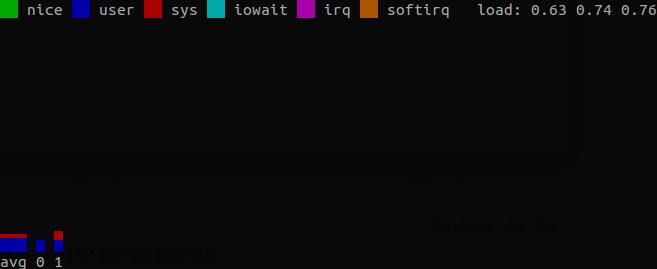

# cpumon



cpumon is a simple terminal-based tool for monitoring CPU load, especially when you work monitoring over SSH. cpumon itself consumes almost no CPU, so it won't perturb other processes like benchmarks you run.

## Installation
Run `make`:

```
$ make
$ make install
$ make clean
```

Or install it using `clib` package manager:

```
$ clib install gioyik/cpumon
```

## Usage
Just run the binary file (if you compile from source):

```
./cpumon
```
